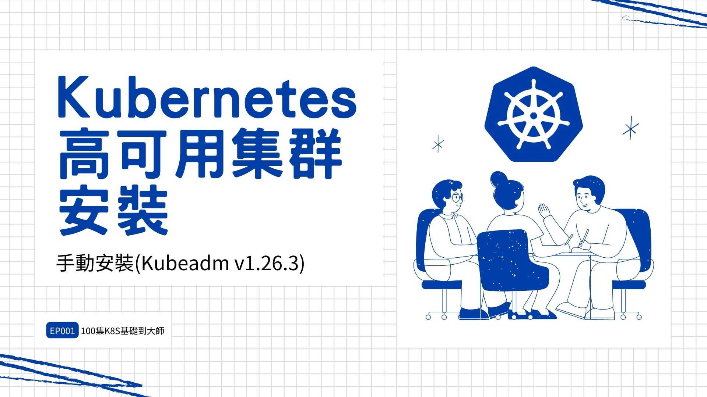
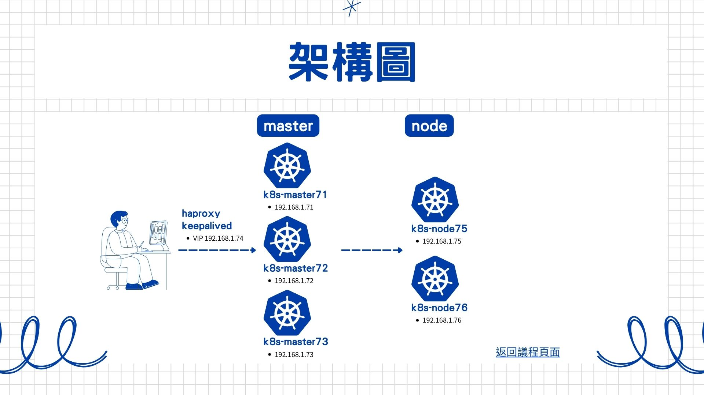

## 一、節點規劃

部署k8s集群的節點按照用途可以劃分為如下2類角色：

- **master**：集群的master節點，集群的初始化節點，基礎配置不低於2C4G
- **node**：集群的node節點，可以多台，基礎配置不低於2C4G

**K8S實體機網段: 192.168.1.0/24**

**POD網段: 10.244.0.0/16**

**SERVICE網段: 10.245.0.0/16**

  

|主機名|節點ip|角色|部署組件|
|---|---|---|---|
|k8s-master71|192.168.1.71|master|etcd, kube-apiserver, kube-controller-manager, kubectl, kubeadm, kubelet, kube-proxy, calico|
|k8s-master72|192.168.1.72|master|etcd, kube-apiserver, kube-controller-manager, kubectl, kubeadm, kubelet, kube-proxy, calico|
|k8s-master73|192.168.1.73|master|etcd, kube-apiserver, kube-controller-manager, kubectl, kubeadm, kubelet, kube-proxy, calico|
||**192.168.1.74**|VIP|作為3台master節點的LB使用|
|k8s-node75|k8s-node75|node|kubectl, kubelet, kube-proxy, calico|
|k8s-node76|k8s-node76|node|kubectl, kubelet, kube-proxy, calico|

  

## 二、組件版本

  

| 組件          | 版本                     | 說明                    |
| ----------- | ---------------------- | --------------------- |
| Ubuntu      | 22.04.3 LTS(待確認)       |                       |
| Kernel      | 5.15.0-83-generic(待確認) |                       |
| etcd        | 3.5.6-0(待確認)           | 使用Pod方式部署，默認數據掛載到本地路徑 |
| coredns     | v1.9.3(待確認)            |                       |
| kubeadm     | v1.26.15               |                       |
| kubectl     | v1.26.15               |                       |
| kubelet     | v1.26.15               |                       |
| kube-proxy  | v1.26.15               |                       |
| calico      | v3.26.0                |                       |
| cri-dockerd | 0.3.3.3-0              |                       |

# 安裝前準備

## 一、設置hosts解析

操作節點：所有節點（`k8s-master，k8s-node`）均需執行

- **添加hosts解析**

```bash
root@k8s-master71:~# cat >>/etc/hosts<<EOF
192.168.1.71 k8s-master71
192.168.1.72 k8s-master72
192.168.1.73 k8s-master73
192.168.1.75 k8s-node75
192.168.1.76 k8s-node76
EOF


root@k8s-master71:~# cat /etc/hosts
127.0.0.1 localhost
127.0.1.1 k8s-master71

# The following lines are desirable for IPv6 capable hosts
::1     ip6-localhost ip6-loopback
fe00::0 ip6-localnet
ff00::0 ip6-mcastprefix
ff02::1 ip6-allnodes
ff02::2 ip6-allrouters
192.168.1.71 k8s-master71
192.168.1.72 k8s-master72
192.168.1.73 k8s-master73
192.168.1.75 k8s-node75
192.168.1.76 k8s-node76
```

## 二、調整系統配置

操作節點： 所有的master和node節點（`k8s-master,k8s-node`）需要執行

> 本章下述操作均以k8s-master為例，其他節點均是相同的操作（ip和hostname的值換成對應機器的真實值）

  

- **設置安全組開放端口**

  

如果節點間無安全組限制（內網機器間可以任意訪問），可以忽略，否則，至少保證如下端口可通： k8s-master節點：TCP：6443，2379，2380，60080，60081UDP協議端口全部打開 k8s-node節點：UDP協議端口全部打開

  

- **關閉防火牆**

```bash
root@k8s-master71:~# ufw status
Status: inactive
```

- **關閉swap**

```bash
root@k8s-master71:~# swapoff -a && sysctl -w vm.swappiness=0
vm.swappiness = 0
root@k8s-master71:~# sed -i 's/.*swap.*/#&/g' /etc/fstab
#/dev/disk/by-id/dm-uuid-LVM-kAtY9KpfwxzNTDEpBzFkOODzcZgK93hc3OfpHLBwOVbgBZUOZC21pLNScKzDP2aI none swap sw 0 0
```

- **修改內核參數**

```bash
root@k8s-master71:~# cat <<EOF | sudo tee /etc/modules-load.d/k8s.conf
overlay
br_netfilter
EOF


root@k8s-master71:~# systemctl restart systemd-modules-load.service
root@k8s-master71:~# systemctl status systemd-modules-load.service
● systemd-modules-load.service - Load Kernel Modules
     Loaded: loaded (/lib/systemd/system/systemd-modules-load.service; static)
     Active: active (exited) since Wed 2023-09-20 00:23:11 UTC; 6s ago
       Docs: man:systemd-modules-load.service(8)
             man:modules-load.d(5)
    Process: 2322 ExecStart=/lib/systemd/systemd-modules-load (code=exited, status=0/SUCCESS)
   Main PID: 2322 (code=exited, status=0/SUCCESS)
        CPU: 39ms

Sep 20 00:23:11 k8s-master71 systemd[1]: Starting Load Kernel Modules...
Sep 20 00:23:11 k8s-master71 systemd-modules-load[2322]: Inserted module 'overlay'
Sep 20 00:23:11 k8s-master71 systemd-modules-load[2322]: Inserted module 'br_netfilter'
Sep 20 00:23:11 k8s-master71 systemd[1]: Finished Load Kernel Modules.


root@k8s-master71:~# lsmod |grep -e overlay
overlay               151552  0

root@k8s-master71:~# lsmod |grep -e br_netfilter
br_netfilter           32768  0
bridge                307200  1 br_netfilter
```

  

```bash
root@k8s-master71:~# cat <<EOF >  /etc/sysctl.d/k8s.conf
vm.max_map_count=262144
net.ipv4.ip_forward = 1
net.bridge.bridge-nf-call-iptables = 1
net.bridge.bridge-nf-call-ip6tables = 1
vm.overcommit_memory=1
vm.panic_on_oom=0
fs.inotify.max_user_watches=89100
fs.file-max=52706963
fs.nr_open=52706963
net.netfilter.nf_conntrack_max=2310720
net.ipv4.tcp_keepalive_time = 600
net.ipv4.tcp_keepalive_probes = 3
net.ipv4.tcp_keepalive_intvl =15
net.ipv4.tcp_max_tw_buckets = 36000
net.ipv4.tcp_tw_reuse = 1
net.ipv4.tcp_max_orphans = 327680
net.ipv4.tcp_orphan_retries = 3
net.ipv4.tcp_syncookies = 1
net.ipv4.tcp_max_syn_backlog = 16384
net.ipv4.tcp_max_syn_backlog = 16384
net.ipv4.tcp_timestamps = 0
net.core.somaxconn = 16384
EOF


root@k8s-master71:~# sysctl -p /etc/sysctl.d/k8s.conf
vm.max_map_count = 262144
net.ipv4.ip_forward = 1
net.bridge.bridge-nf-call-iptables = 1
net.bridge.bridge-nf-call-ip6tables = 1
vm.overcommit_memory = 1
vm.panic_on_oom = 0
fs.inotify.max_user_watches = 89100
fs.file-max = 52706963
fs.nr_open = 52706963
sysctl: cannot stat /proc/sys/net/netfilter/nf_conntrack_max: No such file or directory
net.ipv4.tcp_keepalive_time = 600
net.ipv4.tcp_keepalive_probes = 3
net.ipv4.tcp_keepalive_intvl = 15
net.ipv4.tcp_max_tw_buckets = 36000
net.ipv4.tcp_tw_reuse = 1
net.ipv4.tcp_max_orphans = 327680
net.ipv4.tcp_orphan_retries = 3
net.ipv4.tcp_syncookies = 1
net.ipv4.tcp_max_syn_backlog = 16384
net.ipv4.tcp_max_syn_backlog = 16384
net.ipv4.tcp_timestamps = 0
net.core.somaxconn = 16384
```

```bash
# 報錯
sysctl: cannot stat /proc/sys/net/netfilter/nf_conntrack_max: 沒有此一檔案或目錄


# 解決方式
root@k8s-master71:~# modprobe ip_conntrack
root@k8s-master71:~# sysctl -p /etc/sysctl.d/k8s.conf
vm.max_map_count = 262144
net.ipv4.ip_forward = 1
net.bridge.bridge-nf-call-iptables = 1
net.bridge.bridge-nf-call-ip6tables = 1
vm.overcommit_memory = 1
vm.panic_on_oom = 0
fs.inotify.max_user_watches = 89100
fs.file-max = 52706963
fs.nr_open = 52706963
net.netfilter.nf_conntrack_max = 2310720
net.ipv4.tcp_keepalive_time = 600
net.ipv4.tcp_keepalive_probes = 3
net.ipv4.tcp_keepalive_intvl = 15
net.ipv4.tcp_max_tw_buckets = 36000
net.ipv4.tcp_tw_reuse = 1
net.ipv4.tcp_max_orphans = 327680
net.ipv4.tcp_orphan_retries = 3
net.ipv4.tcp_syncookies = 1
net.ipv4.tcp_max_syn_backlog = 16384
net.ipv4.tcp_max_syn_backlog = 16384
net.ipv4.tcp_timestamps = 0
net.core.somaxconn = 16384
```

- **添加ipvs，安裝套件**

```bash
root@k8s-master71:~# apt -y install ipvsadm ipset sysstat conntrack libseccomp2 libseccomp-dev

root@k8s-master71:~# cat > /etc/modules-load.d/ipvs.conf << EOF
ip_vs
ip_vs_lc
ip_vs_wlc
ip_vs_rr
ip_vs_wrr
ip_vs_lblc
ip_vs_lblcr
ip_vs_dh
ip_vs_sh
ip_vs_fo
ip_vs_nq
ip_vs_sed
ip_vs_ftp
nf_conntrack
ip_tables
ip_set
xt_set
ipt_set
ipt_rpfilter
ipt_REJECT
ipip
EOF


root@k8s-master71:~# systemctl restart systemd-modules-load.service
root@k8s-master71:~# systemctl status systemd-modules-load.service
● systemd-modules-load.service - Load Kernel Modules
     Loaded: loaded (/lib/systemd/system/systemd-modules-load.service; static)
     Active: active (exited) since Wed 2023-09-20 00:28:06 UTC; 7s ago
       Docs: man:systemd-modules-load.service(8)
             man:modules-load.d(5)
    Process: 3116 ExecStart=/lib/systemd/systemd-modules-load (code=exited, status=0/SUCCESS)
   Main PID: 3116 (code=exited, status=0/SUCCESS)
        CPU: 76ms

Sep 20 00:28:06 k8s-master71 systemd-modules-load[3116]: Inserted module 'ip_vs_fo'
Sep 20 00:28:06 k8s-master71 systemd-modules-load[3116]: Inserted module 'ip_vs_nq'
Sep 20 00:28:06 k8s-master71 systemd-modules-load[3116]: Inserted module 'ip_vs_sed'
Sep 20 00:28:06 k8s-master71 systemd-modules-load[3116]: Inserted module 'ip_vs_ftp'
Sep 20 00:28:06 k8s-master71 systemd-modules-load[3116]: Inserted module 'ip_set'
Sep 20 00:28:06 k8s-master71 systemd-modules-load[3116]: Inserted module 'xt_set'
Sep 20 00:28:06 k8s-master71 systemd-modules-load[3116]: Inserted module 'ipt_rpfilter'
Sep 20 00:28:06 k8s-master71 systemd-modules-load[3116]: Inserted module 'ipt_REJECT'
Sep 20 00:28:06 k8s-master71 systemd-modules-load[3116]: Inserted module 'ipip'
Sep 20 00:28:06 k8s-master71 systemd[1]: Finished Load Kernel Modules.


root@k8s-master71:~# lsmod |grep -e ip_vs -e nf_conntrack_ipv4
ip_vs_ftp              16384  0
nf_nat                 49152  1 ip_vs_ftp
ip_vs_sed              16384  0
ip_vs_nq               16384  0
ip_vs_fo               16384  0
ip_vs_sh               16384  0
ip_vs_dh               16384  0
ip_vs_lblcr            16384  0
ip_vs_lblc             16384  0
ip_vs_wrr              16384  0
ip_vs_rr               16384  0
ip_vs_wlc              16384  0
ip_vs_lc               16384  0
ip_vs                 176128  24 ip_vs_wlc,ip_vs_rr,ip_vs_dh,ip_vs_lblcr,ip_vs_sh,ip_vs_fo,ip_vs_nq,ip_vs_lblc,ip_vs_wrr,ip_vs_lc,ip_vs_sed,ip_vs_ftp
nf_conntrack          172032  2 nf_nat,ip_vs
nf_defrag_ipv6         24576  2 nf_conntrack,ip_vs
libcrc32c              16384  7 nf_conntrack,nf_nat,btrfs,nf_tables,xfs,raid456,ip_vs
```

## 三、安裝docker

所有的master和node節點（`k8s-master,k8s-node`）需要執行

[https://docs.docker.com/engine/install/ubuntu/](https://docs.docker.com/engine/install/ubuntu/)


```bash
# 1. Update the apt package index and install packages to allow apt to use a repository over HTTPS:
sudo apt-get update
sudo apt-get install ca-certificates curl gnupg
 
# 2. Add Docker’s official GPG key:
sudo install -m 0755 -d /etc/apt/keyrings
curl -fsSL https://download.docker.com/linux/ubuntu/gpg | sudo gpg --dearmor -o /etc/apt/keyrings/docker.gpg
sudo chmod a+r /etc/apt/keyrings/docker.gpg
 
# 3. Use the following command to set up the repository:
echo \
  "deb [arch="$(dpkg --print-architecture)" signed-by=/etc/apt/keyrings/docker.gpg] https://download.docker.com/linux/ubuntu \
  "$(. /etc/os-release && echo "$VERSION_CODENAME")" stable" | \
  sudo tee /etc/apt/sources.list.d/docker.list > /dev/null

# 4. 檢查是否已經添加源
root@k8s-master71:~# cat /etc/apt/sources.list.d/docker.list
deb [arch=amd64 signed-by=/etc/apt/keyrings/docker.gpg] https://download.docker.com/linux/ubuntu   jammy stable

# 5. Update the apt package index
sudo apt-get update

```

```bash
# 查看所有的可用版本
root@k8s-master71:~# apt-cache madison docker-ce | awk '{ print $3 }'
5:24.0.6-1~ubuntu.22.04~jammy
5:24.0.5-1~ubuntu.22.04~jammy
5:24.0.4-1~ubuntu.22.04~jammy
5:24.0.3-1~ubuntu.22.04~jammy
5:24.0.2-1~ubuntu.22.04~jammy
5:24.0.1-1~ubuntu.22.04~jammy
5:24.0.0-1~ubuntu.22.04~jammy
5:23.0.6-1~ubuntu.22.04~jammy
5:23.0.5-1~ubuntu.22.04~jammy
5:23.0.4-1~ubuntu.22.04~jammy
5:23.0.3-1~ubuntu.22.04~jammy
5:23.0.2-1~ubuntu.22.04~jammy
5:23.0.1-1~ubuntu.22.04~jammy
5:23.0.0-1~ubuntu.22.04~jammy
5:20.10.24~3-0~ubuntu-jammy
5:20.10.23~3-0~ubuntu-jammy
5:20.10.22~3-0~ubuntu-jammy
5:20.10.21~3-0~ubuntu-jammy
5:20.10.20~3-0~ubuntu-jammy
5:20.10.19~3-0~ubuntu-jammy
5:20.10.18~3-0~ubuntu-jammy
5:20.10.17~3-0~ubuntu-jammy
5:20.10.16~3-0~ubuntu-jammy
5:20.10.15~3-0~ubuntu-jammy
5:20.10.14~3-0~ubuntu-jammy
5:20.10.13~3-0~ubuntu-jammy


# 指定版本，安裝docker-ce
root@k8s-master71:~# VERSION_STRING=5:20.10.13~3-0~ubuntu-jammy
root@k8s-master71:~# sudo apt-get install docker-ce=$VERSION_STRING docker-ce-cli=$VERSION_STRING containerd.io
```

  

```bash
## 配置docker使用cgroupdriver=systemd
root@k8s-master71:~# mkdir -p /etc/docker
root@k8s-master71:~# vim /etc/docker/daemon.json
{
  "exec-opts": ["native.cgroupdriver=systemd"]
}


root@k8s-master71:~# systemctl daemon-reload
root@k8s-master71:~# systemctl restart docker


## 啟動docker
root@k8s-master71:~# systemctl enable docker && systemctl start docker
root@k8s-master71:~# systemctl status docker


## 測試起一個容器
root@k8s-master71:~# sudo docker run hello-world
Unable to find image 'hello-world:latest' locally
latest: Pulling from library/hello-world
719385e32844: Pull complete 
Digest: sha256:4f53e2564790c8e7856ec08e384732aa38dc43c52f02952483e3f003afbf23db
Status: Downloaded newer image for hello-world:latest

Hello from Docker!

```

## 四、安裝cri-docker

所有的master和node節點（`k8s-master,k8s-node`）需要執行

[https://github.com/Mirantis/cri-dockerd](https://github.com/Mirantis/cri-dockerd)

```bash
root@k8s-master71:~# wget https://github.com/Mirantis/cri-dockerd/releases/download/v0.3.3/cri-dockerd_0.3.3.3-0.ubuntu-jammy_amd64.deb

root@k8s-master71:~# sudo dpkg -i cri-dockerd_0.3.3.3-0.ubuntu-jammy_amd64.deb 

root@k8s-master71:~# systemctl daemon-reload 

root@k8s-master71:~# systemctl enable cri-docker && systemctl start cri-docker && systemctl status cri-docker
● cri-docker.service - CRI Interface for Docker Application Container Engine
     Loaded: loaded (/lib/systemd/system/cri-docker.service; enabled; vendor preset: enabled)
     Active: active (running) since Wed 2023-09-20 00:44:58 UTC; 25s ago
TriggeredBy: ● cri-docker.socket
       Docs: https://docs.mirantis.com
   Main PID: 5055 (cri-dockerd)
      Tasks: 10
     Memory: 9.8M
        CPU: 83ms
     CGroup: /system.slice/cri-docker.service
             └─5055 /usr/bin/cri-dockerd --container-runtime-endpoint fd://

Sep 20 00:44:58 k8s-master71 cri-dockerd[5055]: time="2023-09-20T00:44:58Z" level=info msg="Start docker client with reque>
Sep 20 00:44:58 k8s-master71 cri-dockerd[5055]: time="2023-09-20T00:44:58Z" level=info msg="Hairpin mode is set to none"
Sep 20 00:44:58 k8s-master71 cri-dockerd[5055]: time="2023-09-20T00:44:58Z" level=info msg="Loaded network plugin cni"
Sep 20 00:44:58 k8s-master71 cri-dockerd[5055]: time="2023-09-20T00:44:58Z" level=info msg="Docker cri networking managed >
Sep 20 00:44:58 k8s-master71 cri-dockerd[5055]: time="2023-09-20T00:44:58Z" level=info msg="Docker Info: &{ID:ZVOJ:5V6C:QO>
Sep 20 00:44:58 k8s-master71 cri-dockerd[5055]: time="2023-09-20T00:44:58Z" level=info msg="Setting cgroupDriver systemd"
Sep 20 00:44:58 k8s-master71 cri-dockerd[5055]: time="2023-09-20T00:44:58Z" level=info msg="Docker cri received runtime co>
Sep 20 00:44:58 k8s-master71 cri-dockerd[5055]: time="2023-09-20T00:44:58Z" level=info msg="Starting the GRPC backend for >
Sep 20 00:44:58 k8s-master71 cri-dockerd[5055]: time="2023-09-20T00:44:58Z" level=info msg="Start cri-dockerd grpc backend"
Sep 20 00:44:58 k8s-master71 systemd[1]: Started CRI Interface for Docker Application Container Engine.
```

# 初始化集群

## 一、安裝kubeadm、kubelet、kubectl

操作節點： 所有的master和node節點(`k8s-master,k8s-node`) 需要執行

[https://kubernetes.io/docs/setup/production-environment/tools/kubeadm/install-kubeadm/](https://kubernetes.io/docs/setup/production-environment/tools/kubeadm/install-kubeadm/)

```bash
# 1. Update the apt package index and install packages needed to use the Kubernetes apt repository:

sudo apt-get update
# apt-transport-https may be a dummy package; if so, you can skip that package
sudo apt-get install -y apt-transport-https ca-certificates curl gpg


# 2. Download the public signing key for the Kubernetes package repositories. The same signing key is used for all repositories so you can disregard the version in the URL:

# If the directory `/etc/apt/keyrings` does not exist, it should be created before the curl command, read the note below.
# sudo mkdir -p -m 755 /etc/apt/keyrings
curl -fsSL https://pkgs.k8s.io/core:/stable:/v1.31/deb/Release.key | sudo gpg --dearmor -o /etc/apt/keyrings/kubernetes-apt-keyring.gpg


# 3. Add the appropriate Kubernetes `apt` repository. Please note that this repository have packages only for Kubernetes 1.31; for other Kubernetes minor versions, you need to change the Kubernetes minor version in the URL to match your desired minor version (you should also check that you are reading the documentation for the version of Kubernetes that you plan to install).

# This overwrites any existing configuration in /etc/apt/sources.list.d/kubernetes.list
echo 'deb [signed-by=/etc/apt/keyrings/kubernetes-apt-keyring.gpg] https://pkgs.k8s.io/core:/stable:/v1.26/deb/ /' | sudo tee /etc/apt/sources.list.d/kubernetes.list


# 4. 檢查是否已經添加源 
root@k8s-master71:~# cat /etc/apt/sources.list.d/kubernetes.list
deb [signed-by=/etc/apt/keyrings/kubernetes-apt-keyring.gpg] https://pkgs.k8s.io/core:/stable:/v1.26/deb/ /


# 5. Update apt package index, install kubelet, kubeadm and kubectl, and pin their version:
sudo apt-get update
```


```bash
root@k8s-master71:~# sudo apt-get install -y kubelet=1.26.15-1.1 kubeadm=1.26.15-1.1 kubectl=1.26.15-1.1


## 查看kubeadm 版本
root@k8s-master71:~# kubeadm version
kubeadm version: &version.Info{Major:"1", Minor:"26", GitVersion:"v1.26.3", GitCommit:"9e644106593f3f4aa98f8a84b23db5fa378900bd", GitTreeState:"clean", BuildDate:"2023-03-15T13:38:47Z", GoVersion:"go1.19.7", Compiler:"gc", Platform:"linux/amd64"}


## 設置kubelet開機啟動，並使用ipvs與systemd
root@k8s-master71:~# vim /etc/default/kubelet
KUBE_PROXY_MODE="ipvs" KUBELET_EXTRA_ARGS="--cgroup-driver=systemd --pod-infra-container-image=registry.k8s.io/pause:3.6"

root@k8s-master71:~# systemctl enable --now kubelet
```

## 二、安裝配置haproxy、keepalived

<font color=red>操作節點： 所有的master</font>

注意：如果有兩個集群，都在同一網段內，/etc/keepalived/keepalived.conf裡面的virtual_router_id 60記得要不一樣，不然/var/log/message會一直報錯。

```bash
root@k8s-master71:~# apt-get install keepalived haproxy -y
```

```bash
# 所有master節點執行,注意替換最後的master節點IP地址
root@k8s-master71:~# vim /etc/haproxy/haproxy.cfg 
global
  maxconn  2000
  ulimit-n  16384
  log  127.0.0.1 local0 err
  stats timeout 30s
defaults
  log global
  mode  http
  option  httplog
  timeout connect 5000
  timeout client  50000
  timeout server  50000
  timeout http-request 15s
  timeout http-keep-alive 15s
frontend monitor-in
  bind *:33305
  mode http
  option httplog
  monitor-uri /monitor
frontend k8s-master
  bind 0.0.0.0:7443
  bind 127.0.0.1:7443
  mode tcp
  option tcplog
  tcp-request inspect-delay 5s
  default_backend k8s-master
backend k8s-master
  mode tcp
  option tcplog
  option tcp-check
  balance roundrobin
  default-server inter 10s downinter 5s rise 2 fall 2 slowstart 60s maxconn 250 maxqueue 256 weight 100
  server k8s-master71    192.168.1.71:6443   check
  server k8s-master72    192.168.1.72:6443   check
  server k8s-master73    192.168.1.73:6443   check 
  

# 在k8s-master71節點，注意mcast_src_ip換成實際的master1ip地址，virtual_ipaddress換成lb地址，interface要替換成主機IP使用的介面
root@k8s-master71:~# vim /etc/keepalived/keepalived.conf
! Configuration File for keepalived
global_defs {
    router_id LVS_DEVEL
script_user root
    enable_script_security
}
vrrp_script chk_apiserver {
    script "/etc/keepalived/check_apiserver.sh"
    interval 5
    weight -5
    fall 2
    rise 1
}
vrrp_instance VI_1 {
    state MASTER
    interface ens160
    mcast_src_ip 192.168.1.71
    virtual_router_id 60
    priority 101
    advert_int 2
    authentication {
        auth_type PASS
        auth_pass K8SHA_KA_AUTH
    }
    virtual_ipaddress {
        192.168.1.74
    }
    track_script {
       chk_apiserver
    }
}
# 在k8s-master52u和k8s-master53u分別創建/etc/keepalived/keepalived.conf，注意修改mcast_src_ip和virtual_ipaddress


#所有master節點配置KeepAlived健康檢查文件：
root@k8s-master71:~# vim /etc/keepalived/check_apiserver.sh
#!/bin/bash
err=0
for k in $(seq 1 3)
do
    check_code=$(pgrep haproxy)
    if [[ $check_code == "" ]]; then
        err=$(expr $err + 1)
        sleep 1
        continue
    else
        err=0
        break
    fi
done
if [[ $err != "0" ]]; then
    echo "systemctl stop keepalived"
    /usr/bin/systemctl stop keepalived
    exit 1
else
    exit 0
fi


# 啟動haproxy和keepalived---->所有master節點
root@k8s-master71:~# chmod +x /etc/keepalived/check_apiserver.sh
root@k8s-master71:~# systemctl daemon-reload

root@k8s-master71:~# systemctl enable --now haproxy
root@k8s-master71:~# systemctl enable --now keepalived 

root@k8s-master71:~# systemctl restart haproxy
root@k8s-master71:~# systemctl restart keepalived 

root@k8s-master71:~# systemctl status haproxy
root@k8s-master71:~# systemctl status keepalived 


# 測試lbip是否生效(從node節點測試的)
root@k8s-node76:~# telnet 192.168.1.74 7443
Trying 192.168.1.74...
Connected to 192.168.1.74.
Escape character is '^]'.
Connection closed by foreign host.

```

## 三、初始化配置文件

操作節點： 只在master節點（`k8s-master`）執行

[https://kubernetes.io/docs/reference/config-api/kubeadm-config.v1beta3/](https://kubernetes.io/docs/reference/config-api/kubeadm-config.v1beta3/)

```bash
# 1.24.0版本之後，需修改為criSocket: unix:///var/run/cri-dockerd.sock
# 1.27.x版本之後，需修改為apiVersion: kubeadm.k8s.io/v1beta3，v1beta2不能用了
# imageRepository: k8s.gcr.io已不更新，改imageRepository: registry.k8s.io
# clusterName: kubernetes ->依自己需求修改
# dns: type: CoreDNS 已棄用，不用寫


root@k8s-master71:~# vim kubeadm.yaml 
apiVersion: kubeadm.k8s.io/v1beta3
bootstrapTokens:
- groups:
  - system:bootstrappers:kubeadm:default-node-token
  token: 7t2weq.bjbawausm0jaxury
  ttl: 24h0m0s
  usages:
  - signing
  - authentication
kind: InitConfiguration
localAPIEndpoint:
  advertiseAddress: 192.168.1.71
  bindPort: 6443
nodeRegistration:
  criSocket: unix:///var/run/cri-dockerd.sock
  name: k8s-master71
  taints:
  - effect: NoSchedule
    key: node-role.kubernetes.io/master
---
apiServer:
  certSANs:
  - 192.168.1.74
  timeoutForControlPlane: 4m0s
apiVersion: kubeadm.k8s.io/v1beta3
certificatesDir: /etc/kubernetes/pki
clusterName: kubernetes
controlPlaneEndpoint: 192.168.1.74:7443
controllerManager: {}
etcd:
  local:
    dataDir: /var/lib/etcd
imageRepository: registry.k8s.io
kind: ClusterConfiguration
kubernetesVersion: v1.26.155
networking:
  dnsDomain: cluster.local
  podSubnet: 10.244.0.0/16
  serviceSubnet: 10.245.0.0/16
scheduler: {}
```

## 四、提前下載鏡像

操作節點：所有master節點執行

```bash
root@k8s-master71:~# kubeadm config images list --config kubeadm.yaml
registry.k8s.io/kube-apiserver:v1.26.15
registry.k8s.io/kube-controller-manager:v1.26.15
registry.k8s.io/kube-scheduler:v1.26.15
registry.k8s.io/kube-proxy:v1.26.15
registry.k8s.io/pause:3.9
registry.k8s.io/etcd:3.5.6-0
registry.k8s.io/coredns/coredns:v1.9.3


root@k8s-master71:~# kubeadm config images pull --config kubeadm.yaml
[config/images] Pulled registry.k8s.io/kube-apiserver:v1.26.15
[config/images] Pulled registry.k8s.io/kube-controller-manager:v1.26.15
[config/images] Pulled registry.k8s.io/kube-scheduler:v1.26.15
[config/images] Pulled registry.k8s.io/kube-proxy:v1.26.15
[config/images] Pulled registry.k8s.io/pause:3.9
[config/images] Pulled registry.k8s.io/etcd:3.5.6-0
[config/images] Pulled registry.k8s.io/coredns/coredns:v1.9.3

```

## 五、初始化master節點

操作節點：只在master節點（`k8s-master`）執行，找一台master執行即可

```bash
root@k8s-master71:~# kubeadm init --config kubeadm.yaml --upload-certs


## 若初始化成功後，最後會提示如下信息：

Your Kubernetes control-plane has initialized successfully!

To start using your cluster, you need to run the following as a regular user:

  mkdir -p $HOME/.kube
  sudo cp -i /etc/kubernetes/admin.conf $HOME/.kube/config
  sudo chown $(id -u):$(id -g) $HOME/.kube/config

Alternatively, if you are the root user, you can run:

  export KUBECONFIG=/etc/kubernetes/admin.conf

You should now deploy a pod network to the cluster.
Run "kubectl apply -f [podnetwork].yaml" with one of the options listed at:
  https://kubernetes.io/docs/concepts/cluster-administration/addons/

You can now join any number of the control-plane node running the following command on each as root:

  kubeadm join 192.168.1.74:7443 --token 7t2weq.bjbawausm0jaxury \
	--discovery-token-ca-cert-hash sha256:86af29371fd57d46a8592782fb4ae158035711372c0541449dcadfdc8f7fc243 \
	--control-plane --certificate-key a543d4775e0ca9787d4d2936758a3447d189cdae117170512b4de60a23b59e8a

Please note that the certificate-key gives access to cluster sensitive data, keep it secret!
As a safeguard, uploaded-certs will be deleted in two hours; If necessary, you can use
"kubeadm init phase upload-certs --upload-certs" to reload certs afterward.

Then you can join any number of worker nodes by running the following on each as root:

kubeadm join 192.168.1.74:7443 --token 7t2weq.bjbawausm0jaxury \
	--discovery-token-ca-cert-hash sha256:86af29371fd57d46a8592782fb4ae158035711372c0541449dcadfdc8f7fc243 


## 接下來按照上述提示信息操作，配置kubectl客戶端的認證

root@k8s-master71:~# mkdir -p $HOME/.kube
root@k8s-master71:~# sudo cp -i /etc/kubernetes/admin.conf $HOME/.kube/config
root@k8s-master71:~# sudo chown $(id -u):$(id -g) $HOME/.kube/config
```

> 若執行初始化過程中出錯，根據錯誤信息調整後，執行 kubeadm reset -f ; ipvsadm --clear ; rm -rf ~/.kube ; rm -rf /etc/kubernetes/manifests/* ; rm -rf /var/lib/etcd/

## 六、添加其他master節點到集群中

```bash
# k8s-master72主機
root@k8s-master72:~#   kubeadm join 192.168.1.74:7443 --token 7t2weq.bjbawausm0jaxury \
	--discovery-token-ca-cert-hash sha256:86af29371fd57d46a8592782fb4ae158035711372c0541449dcadfdc8f7fc243 \
	--control-plane --certificate-key a543d4775e0ca9787d4d2936758a3447d189cdae117170512b4de60a23b59e8a \
	--cri-socket=unix:///var/run/cri-dockerd.sock

root@k8s-master72:~# mkdir -p $HOME/.kube
root@k8s-master72:~# sudo cp -i /etc/kubernetes/admin.conf $HOME/.kube/config
root@k8s-master72:~# sudo chown $(id -u):$(id -g) $HOME/.kube/config


# k8s-master73主機
root@k8s-master73:~#   kubeadm join 192.168.1.74:7443 --token 7t2weq.bjbawausm0jaxury \
	--discovery-token-ca-cert-hash sha256:86af29371fd57d46a8592782fb4ae158035711372c0541449dcadfdc8f7fc243 \
	--control-plane --certificate-key a543d4775e0ca9787d4d2936758a3447d189cdae117170512b4de60a23b59e8a \
	--cri-socket=unix:///var/run/cri-dockerd.sock

root@k8s-master73:~# mkdir -p $HOME/.kube
root@k8s-master73:~# sudo cp -i /etc/kubernetes/admin.conf $HOME/.kube/config
root@k8s-master73:~# sudo chown $(id -u):$(id -g) $HOME/.kube/config

```

## 七、添加node節點到集群中

操作節點：所有的node節點（`k8s-node`）需要執行 在每台node節點，執行如下命令，該命令是在kubeadm init成功後提示信息中打印出來的，需要替換成實際init後打印出的命令。

```bash
# k8s-node75主機
root@k8s-node75:~# kubeadm join 192.168.1.74:7443 --token 7t2weq.bjbawausm0jaxury \
	--discovery-token-ca-cert-hash sha256:86af29371fd57d46a8592782fb4ae158035711372c0541449dcadfdc8f7fc243 \
	--cri-socket=unix:///var/run/cri-dockerd.sock


# k8s-node76主機
root@k8s-node76:~# kubeadm join 192.168.1.74:7443 --token 7t2weq.bjbawausm0jaxury \
	--discovery-token-ca-cert-hash sha256:86af29371fd57d46a8592782fb4ae158035711372c0541449dcadfdc8f7fc243 \
	--cri-socket=unix:///var/run/cri-dockerd.sock

```

如果忘記添加命令，可以通過如下命令生成：

```bash
$ kubeadm token create --print-join-command
```

查看目前node狀況:

```bash
root@k8s-master71:~# kubectl get node
NAME            STATUS     ROLES           AGE     VERSION
k8s-master71   NotReady   control-plane   10m     v1.26.15
k8s-master72   NotReady   control-plane   3m58s   v1.26.15
k8s-master73   NotReady   control-plane   2m57s   v1.26.15
k8s-node75     NotReady   <none>          55s     v1.26.15
k8s-node76     NotReady   <none>          51s     v1.26.15
```

## 部署容器網絡（calico）

操作節點：只在master節點（`k8s-master`）執行，找一台master執行即可，CNI

Calico是一個純三層的數據中心網絡方案，是目前Kubernetes主流的網絡方案。

[https://docs.tigera.io/calico/latest/getting-started/kubernetes/quickstart](https://docs.tigera.io/calico/latest/getting-started/kubernetes/quickstart)

```bash
root@k8s-master71:~# mkdir calico

root@k8s-master71:~# cd calico/

root@k8s-master71:~/calico# wget https://raw.githubusercontent.com/projectcalico/calico/v3.26.0/manifests/tigera-operator.yaml

root@k8s-master71:~/calico# wget https://raw.githubusercontent.com/projectcalico/calico/v3.26.0/manifests/custom-resources.yaml

root@k8s-master71:~/calico# kubectl create -f tigera-operator.yaml


# cidr ip部分，與前面kubeadm init的 --pod-network-cidr指定的一樣。
root@k8s-master71:~/calico# vim custom-resources.yaml 
# This section includes base Calico installation configuration.
# For more information, see: https://projectcalico.docs.tigera.io/master/reference/installation/api#operator.tigera.io/v1.Installation
apiVersion: operator.tigera.io/v1
kind: Installation
metadata:
  name: default
spec:
  # Configures Calico networking.
  calicoNetwork:
    # Note: The ipPools section cannot be modified post-install.
    ipPools:
    - blockSize: 26
      cidr: 10.244.0.0/16
      encapsulation: VXLANCrossSubnet
      natOutgoing: Enabled
      nodeSelector: all()

---

# This section configures the Calico API server.
# For more information, see: https://projectcalico.docs.tigera.io/master/reference/installation/api#operator.tigera.io/v1.APIServer
apiVersion: operator.tigera.io/v1
kind: APIServer
metadata:
  name: default
spec: {}


root@k8s-master71:~/calico# kubectl create -f custom-resources.yaml


# 等Calico Pod都Running，節點也會准備就緒。
root@k8s-master71:~/calico# kubectl get pods -n calico-system
NAME                                       READY   STATUS    RESTARTS   AGE
calico-kube-controllers-676484d755-9llvm   1/1     Running   0          16m
calico-node-2s4gl                          1/1     Running   0          16m
calico-node-f9dz9                          1/1     Running   0          16m
calico-node-kvc55                          1/1     Running   0          16m
calico-node-l9gb2                          1/1     Running   0          16m
calico-node-xdp42                          1/1     Running   0          16m
calico-typha-98f544f9f-nqc4n               1/1     Running   0          16m
calico-typha-98f544f9f-plpnn               1/1     Running   0          16m
calico-typha-98f544f9f-vgrmn               1/1     Running   0          16m
csi-node-driver-42c8p                      2/2     Running   0          16m
csi-node-driver-kdd42                      2/2     Running   0          16m
csi-node-driver-nxf5d                      2/2     Running   0          16m
csi-node-driver-rphdj                      2/2     Running   0          16m
csi-node-driver-shs2s                      2/2     Running   0          16m


root@k8s-master71:~/calico# kubectl get node
NAME            STATUS   ROLES           AGE   VERSION
k8s-master71   Ready    control-plane   31m   v1.26.15
k8s-master72   Ready    control-plane   24m   v1.26.15
k8s-master73   Ready    control-plane   23m   v1.26.15
k8s-node75     Ready    <none>          21m   v1.26.15
k8s-node76     Ready    <none>          21m   v1.26.15


root@k8s-master71:~/calico# kubectl get pods -n kube-system
NAME                                    READY   STATUS    RESTARTS      AGE
coredns-787d4945fb-6x8v2                1/1     Running   0             31m
coredns-787d4945fb-ddpgp                1/1     Running   0             31m
etcd-k8s-master71                      1/1     Running   0             31m
etcd-k8s-master72                      1/1     Running   0             24m
etcd-k8s-master73                      1/1     Running   0             23m
kube-apiserver-k8s-master71            1/1     Running   0             31m
kube-apiserver-k8s-master72            1/1     Running   0             24m
kube-apiserver-k8s-master73            1/1     Running   1 (23m ago)   23m
kube-controller-manager-k8s-master71   1/1     Running   1 (24m ago)   31m
kube-controller-manager-k8s-master72   1/1     Running   0             24m
kube-controller-manager-k8s-master73   1/1     Running   0             22m
kube-proxy-4rtwz                        1/1     Running   0             23m
kube-proxy-84v9t                        1/1     Running   0             24m
kube-proxy-9bh8t                        1/1     Running   0             21m
kube-proxy-m5gj8                        1/1     Running   0             21m
kube-proxy-x4t5v                        1/1     Running   0             31m
kube-scheduler-k8s-master71            1/1     Running   1 (24m ago)   31m
kube-scheduler-k8s-master72            1/1     Running   0             24m
kube-scheduler-k8s-master73            1/1     Running   0             22m


```

註：以後所有yaml文件都只在Master節點執行。

安裝目錄：/etc/kubernetes/

組件配置文件目錄：/etc/kubernetes/manifests/

# 集群設置

## 設置master節點是否可調度（可選）

操作節點：`k8s-master`

默認部署成功後，master節點無法調度業務pod，如需設置master節點也可以參與pod的調度，需執行：

```bash
$ kubectl taint node k8s-master node-role.kubernetes.io/master:NoSchedule-
```

## 設置kubectl自動補全

操作節點：`k8s-master`

```bash
root@k8s-master71:~# apt install -y bash-completion

root@k8s-master71:~# apt install plocate

root@k8s-master71:~# locate bash_completion

root@k8s-master71:~# source /usr/share/bash-completion/bash_completion

root@k8s-master71:~# source <(kubectl completion bash)

root@k8s-master71:~# echo "source <(kubectl completion bash)" >> ~/.bashrc
```

# 調整證書過期

使用kubeadm安裝的集群，證書默認有效期為1年，可以通過如下方式修改為10年。**全部master節點都要執行**

```bash
root@k8s-master71:~/calico# cd /etc/kubernetes/pki

root@k8s-master71:/etc/kubernetes/pki# for i in $(ls *.crt); do echo "===== $i ====="; openssl x509 -in $i -text -noout | grep -A 3 'Validity' ; done
===== apiserver.crt =====
        Validity
            Not Before: Sep 20 04:42:27 2023 GMT
            Not After : Sep 19 04:42:27 2024 GMT
        Subject: CN = kube-apiserver
===== apiserver-etcd-client.crt =====
        Validity
            Not Before: Sep 20 04:42:28 2023 GMT
            Not After : Sep 19 04:42:29 2024 GMT
        Subject: O = system:masters, CN = kube-apiserver-etcd-client
===== apiserver-kubelet-client.crt =====
        Validity
            Not Before: Sep 20 04:42:27 2023 GMT
            Not After : Sep 19 04:42:27 2024 GMT
        Subject: O = system:masters, CN = kube-apiserver-kubelet-client
===== ca.crt =====
        Validity
            Not Before: Sep 20 04:42:27 2023 GMT
            Not After : Sep 17 04:42:27 2033 GMT
        Subject: CN = kubernetes
===== front-proxy-ca.crt =====
        Validity
            Not Before: Sep 20 04:42:27 2023 GMT
            Not After : Sep 17 04:42:27 2033 GMT
        Subject: CN = front-proxy-ca
===== front-proxy-client.crt =====
        Validity
            Not Before: Sep 20 04:42:27 2023 GMT
            Not After : Sep 19 04:42:28 2024 GMT
        Subject: CN = front-proxy-client


root@k8s-master71:/etc/kubernetes/pki# mkdir backup_key; cp -rp ./* backup_key/
root@k8s-master71:/etc/kubernetes/pki# git clone https://github.com/yuyicai/update-kube-cert.git
root@k8s-master71:/etc/kubernetes/pki# cd update-kube-cert/ 
root@k8s-master71:/etc/kubernetes/pki/update-kube-cert# bash update-kubeadm-cert.sh all


root@k8s-master71:/etc/kubernetes/pki/update-kube-cert# kubectl -n kube-system delete po kube-apiserver-k8s-master71 kube-apiserver-k8s-master72 kube-apiserver-k8s-master73 kube-controller-manager-k8s-master71 kube-controller-manager-k8s-master72 kube-controller-manager-k8s-master73 kube-scheduler-k8s-master71 kube-scheduler-k8s-master72 kube-scheduler-k8s-master73

root@k8s-master71:/etc/kubernetes/pki/update-kube-cert# kubectl get pod -n kube-system
NAME                                    READY   STATUS    RESTARTS      AGE
coredns-787d4945fb-6x8v2                1/1     Running   0             36m
coredns-787d4945fb-ddpgp                1/1     Running   0             36m
etcd-k8s-master71                      1/1     Running   0             36m
etcd-k8s-master72                      1/1     Running   0             29m
etcd-k8s-master73                      1/1     Running   0             28m
kube-apiserver-k8s-master71            1/1     Running   0             30s
kube-apiserver-k8s-master72            1/1     Running   0             30s
kube-apiserver-k8s-master73            1/1     Running   1 (28m ago)   30s
kube-controller-manager-k8s-master71   1/1     Running   1 (29m ago)   30s
kube-controller-manager-k8s-master72   1/1     Running   0             30s
kube-controller-manager-k8s-master73   1/1     Running   0             30s
kube-proxy-4rtwz                        1/1     Running   0             28m
kube-proxy-84v9t                        1/1     Running   0             29m
kube-proxy-9bh8t                        1/1     Running   0             26m
kube-proxy-m5gj8                        1/1     Running   0             26m
kube-proxy-x4t5v                        1/1     Running   0             36m
kube-scheduler-k8s-master71            1/1     Running   2 (69s ago)   30s
kube-scheduler-k8s-master72            1/1     Running   0             30s
kube-scheduler-k8s-master73            1/1     Running   0             30s


root@k8s-master71:/etc/kubernetes/pki/update-kube-cert# cd /etc/kubernetes/pki
root@k8s-master71:/etc/kubernetes/pki# for i in $(ls *.crt); do echo "===== $i ====="; openssl x509 -in $i -text -noout | grep -A 3 'Validity' ; done
===== apiserver.crt =====
        Validity
            Not Before: Sep 20 05:17:58 2023 GMT
            Not After : Sep 17 05:17:58 2033 GMT
        Subject: CN = kube-apiserver
===== apiserver-etcd-client.crt =====
        Validity
            Not Before: Sep 20 05:17:55 2023 GMT
            Not After : Sep 17 05:17:55 2033 GMT
        Subject: O = system:masters, CN = kube-apiserver-etcd-client
===== apiserver-kubelet-client.crt =====
        Validity
            Not Before: Sep 20 05:17:58 2023 GMT
            Not After : Sep 17 05:17:58 2033 GMT
        Subject: O = system:masters, CN = kube-apiserver-kubelet-client
===== ca.crt =====
        Validity
            Not Before: Sep 20 04:42:27 2023 GMT
            Not After : Sep 17 04:42:27 2033 GMT
        Subject: CN = kubernetes
===== front-proxy-ca.crt =====
        Validity
            Not Before: Sep 20 04:42:27 2023 GMT
            Not After : Sep 17 04:42:27 2033 GMT
        Subject: CN = front-proxy-ca
===== front-proxy-client.crt =====
        Validity
            Not Before: Sep 20 05:17:59 2023 GMT
            Not After : Sep 17 05:17:59 2033 GMT
        Subject: CN = front-proxy-client

```

# 驗證集群

操作節點： 在master節點（`k8s-master`）執行

```bash
root@k8s-master71:~# kubectl get nodes
NAME            STATUS   ROLES           AGE   VERSION
k8s-master71   Ready    control-plane   39m   v1.26.15
k8s-master72   Ready    control-plane   32m   v1.26.15
k8s-master73   Ready    control-plane   31m   v1.26.15
k8s-node75     Ready    <none>          29m   v1.26.15
k8s-node76     Ready    <none>          29m   v1.26.15


root@k8s-master71:~# kubectl run  test-nginx --image=nginx:alpine
pod/test-nginx created


root@k8s-master71:~# kubectl get pod -o wide
NAME         READY   STATUS    RESTARTS   AGE   IP               NODE          NOMINATED NODE   READINESS GATES
test-nginx   1/1     Running   0          21s   10.244.255.195   k8s-node76   <none>           <none>


root@k8s-master71:~# curl 10.244.255.195
<!DOCTYPE html>
<html>
<head>
<title>Welcome to nginx!</title>
<style>
html { color-scheme: light dark; }
body { width: 35em; margin: 0 auto;
font-family: Tahoma, Verdana, Arial, sans-serif; }
</style>
</head>
<body>
<h1>Welcome to nginx!</h1>
<p>If you see this page, the nginx web server is successfully installed and
working. Further configuration is required.</p>

<p>For online documentation and support please refer to
<a href="http://nginx.org/">nginx.org</a>.<br/>
Commercial support is available at
<a href="http://nginx.com/">nginx.com</a>.</p>

<p><em>Thank you for using nginx.</em></p>
</body>
</html>
```

